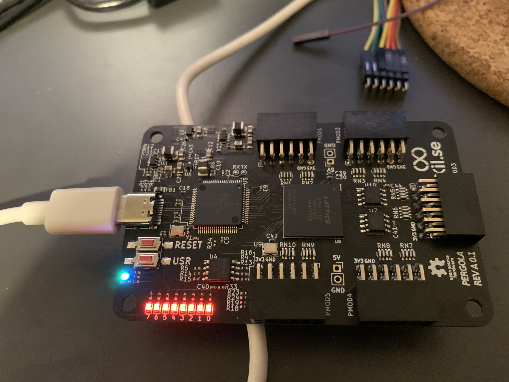

# Pergola FPGA

The Pergola FPGA board is a low-cost, open-source FPGA development board featuring the Lattice ECP5 FPGA.



# Current status

## RevA 0.1

A handful of units have been built for initial test and bringup populated with LFE5U-12F-8BG256C.

It has been tested and works if the fixes below are applied.

### Errata:

- iMX ROM bootloader freezes because the UART RX pin is pulled
   low by the FPGA during boot. (FPGA pin is PL35B_VREF_1_6)
   A 4K7 pull-up is probably not enough, the voltage drops to 2.9V.
   Workaround: Bodge a 1K pull-up between UART_RX and 3V3.
- Wrong load caps for the xtal. Should be 20pF.
- SWD IO and CLK are swapped on the silk.
- IMX_BOOT_MODE_0 and IMX_BOOT_MODE_1 are swapped on the silk.
- A 1K pull-down is on the `~FPGA_HOLD~` net to allow the iMX to use the flash exclusively during boot-up.

# Firmware
TODO.

Currently I have a very ugly test project that can be loaded into the iMX's RAM using the ROM bootloader. This will open up a CDC interface that can be used to send a bitstream to the FPGA.

Currently working on porting the UF2 bootloader in order to update the firmware easily using USB and not having to use the SWD pins.

Current *horrible* hack is located over at [git.xil.se](https://git.xil.se/kbeckmann/pergola_fw) and contains a prebuilt binary.

The firmware will expose a cdc_acm device over USB. To program a bitstream, you simply have to write the number of bytes it is, followed by a newline (`\n`), followed by the bitstream.

# Getting started

- Clone my fork of the imx usb loader project:
```
git clone https://github.com/kbeckmann/imx_usb_loader && cd imx_usb_loader
```
- Checkout the `imxrt1010` branch:
```
git checkout imxrt1010
```
- Build it:
```
make
```
- Clone this repository and change to the firmware directory:
```
cd .. && git clone https://github.com/pergola-fpga/pergola && cd pergola/firmware
```
- Run the loader:
```
../../imx_usb_loader
```
. You might have to run it with `sudo`.
- Check `dmesg` to see if you got a cdc_acm device, e.g. `ttyACM0`
- Now you'll be able to send a bitstream to the board:
```
export ACM_DEVICE=/dev/ttyACM0
export PROGRAM_BIN=path/to/your/top.bin

# If you don't have setup udev rules
sudo chown $UID:$GID $ACM_DEVICE

# Configure the ACM device to be raw, this prevents weird stuff from happening when we send raw binary data.
stty -F $ACM_DEVICE 300 raw -clocal -echo icrnl;
sleep 0.01;
cat $ACM_DEVICE &;
echo -n "$(stat -c%s $PROGRAM_BIN)\n" > $ACM_DEVICE;
cp $PROGRAM_BIN $ACM_DEVICE; sync
```

- This should generate the following output more or less:
```
Reading 582369 bytes
READ_ID: ff ff ff ff 21 11 10 43

Done programming. FPGA_DONE=1
P E R G O L A

<bytes to load><\n>; Load bitstream to FPGA SRAM
```

# How to contribute

Feel free to submit a PR, create an issue.

Discussion happens on [Gitter](https://gitter.im/pergola-fpga/Lobby) for the time being. You can also ping [@kbeckmann](https://twitter.com/kbeckmann) on Twitter.
